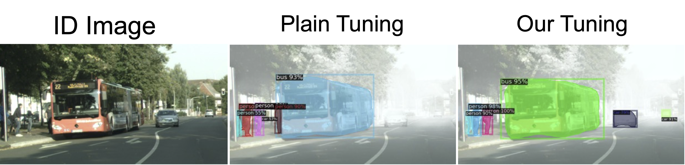

# [Mind the Backbone: Minimizing Backbone Distortion for Robust Object Detection](https://arxiv.org/abs/2303.14744)

This repo contains the implementation of the
paper, [Mind the Backbone: Minimizing Backbone Distortion for Robust Object Detection](https://arxiv.org/abs/2303.14744)
.

<center>

</center>

## Weights

### Backbone

Download weights for efficientnet, resnet50 instagram model, and convnext.
For other models, we use timm or see model_list.txt to download.

```
mkdir pre_models
cd pre_models
wget https://github.com/rwightman/pytorch-image-models/releases/download/v0.1-weights/tf_efficientnet_b2_ns-00306e48.pth
wget https://dl.fbaipublicfiles.com/semiweaksupervision/model_files/semi_weakly_supervised_resnet50-16a12f1b.pth
wget https://dl.fbaipublicfiles.com/convnext/convnext_base_22k_224.pth 
```

### Pre-trained decoder

Download from [here](https://drive.google.com/file/d/1WlkNhmmdrppTTqbAtCay9k3lLCL3-X4G/view?usp=sharing)

## Dataset

See following links for the details of each dataset,

[Clipart, Watercolor, Comic](https://naoto0804.github.io/cross_domain_detection/)

[BDD](https://github.com/xinw1012/cycle-confusion) * Json split used for evaluation
is [here](https://drive.google.com/file/d/1fXbjgEXgvGWeZAhAlMHsu_3cCcIEErjK/view?usp=sharing).

[Cityscapes](https://www.cityscapes-dataset.com/)

[FoggyCityscapes](http://people.ee.ethz.ch/~csakarid/SFSU_synthetic/) * beta 0.02 is used for evaluation

Put directories under directory named VOCdevkit as follows:

```
|-- VOC2007
|   |-- Annotations
|   |-- ImageSets
|   |-- JPEGImages
|-- VOC2012
|-- VOC_Clipart
|-- VOC_Water
|-- VOC_Comic
|-- bdd100k
    |-- images
        |-- 100k
        |-- 10k
`   |-- labels
|-- cityscapes
    |-- gtFine
    |-- leftImg8bit
|-- foggy_images
    |-- train
    |-- val
```

## Training

Run following commands in this directory before starting the training or use pre-trained decoder provided above.

```
export DETECTRON2_DATASETS=$VOCdevkit # it needs to be the path to VOCdevkit.
export PYTHONPATH="$PWD:$PYTHONPATH"
```

### Pre-training decoder

Run following commands in this directory.

```
python tools/train.py --config configs/Pascal/base.yaml --num-gpus 1 \\
OUTPUT_DIR tmp MODEL.PRETRAIN_NAME fbnet TRAIN.PRETRAIN True
```

### Fine-tuning with regularization

```
## Train with RGN regularization
python tools/train.py --config configs/Pascal/base.yaml --num-gpus 1 \\
OUTPUT_DIR path_to_dir MODEL.PRETRAIN_NAME fbnet MODEL.WEIGHTS pretrained_detector/pascal_fbnet_pretrain.pth TRAIN.REG.RGN True \\
SOLVER.COEFF 0.1
```

TRAIN.REG.RGN == True => Apply RGN weighted regularization.

TRAIN.REG.EWC == True => Apply EWC weighted regularization.

TRAIN.REG.PLAINDIST == True => Apply plain weighted regularization.

## TEST

Run following commands in this directory.

```
python tools/train.py --config configs/Pascal/base.yaml --num-gpu 1 --eval-only MODEL.WEIGHTS path_to_weight
```

## Citation

If you find this repository useful for your publications, please consider citing our paper.

```
@article{saito2023mind,
  title={Mind the Backbone: Minimizing Backbone Distortion for Robust Object Detection},
  author={Saito, Kuniaki and Kim, Donghyun and Teterwak, Piotr and Feris, Rogerio and Saenko, Kate},
  journal={arXiv preprint arXiv:2303.14744},
  year={2023}
}
```


